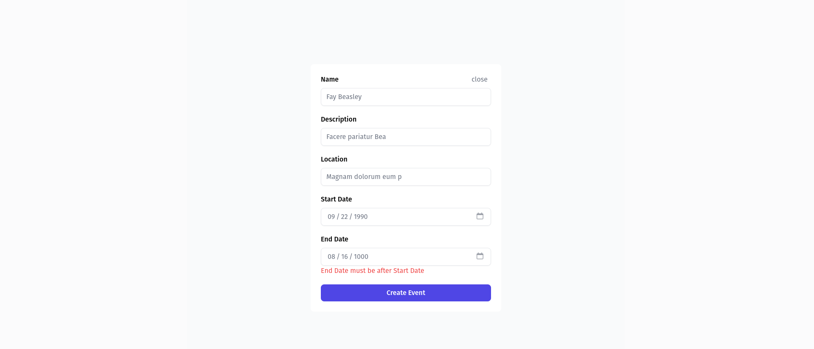

# Event Management

- Pre-requirements
  - `Node.js`
    Installed in the computer.
- cd into cloned directory.

- You can find three directories:

  - **frontend** : contains frontend of the application

  - **backend** : contains the backend code with two directories

- cd into each of the above mentioned directories i.e:frontend and backend in seperate terminal and,

  - Install require dependencies:
    `npm install`

    - Create a .env file in the both directory and add the required environment variables copy from env.example.

  - Start the server:
    `npm run dev`

- Open `http://localhost:3001` in browser

### Repository Design

The Repository Pattern is employed in the backend to encapsulate the logic for database operations. All interactions with the database, including insertion, deletion, update, and retrieval of events and user data, are centralized within the `repositories` folder.

- **`eventRepository.ts`**: Manages all database operations related to events.
- **`userRepository.ts`**: Handles database interactions for user-related operations.

This design choice enhances code modularity, making it easier to switch between different databases or make changes to the database layer without affecting other parts of the application.

### Screenshots

![Login] (login.png)
![Signup] (signup.png)
